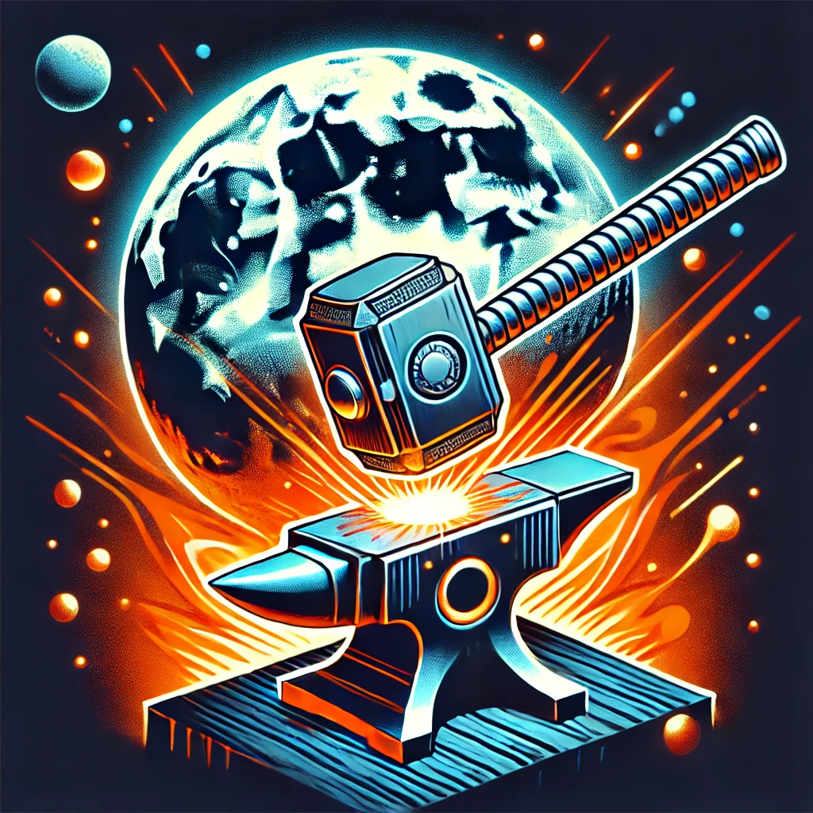

	
	<b><i>ModuleForge</i></b>

	A collection of Luau packages tailored to supercharge your development experience and speed! 🚀
	 You can view documentation for each package [here](https://qscythee.github.io/ModuleForge).

	<a href="https://github.com/qscythee/ModuleForge/actions"></img></a>
	</img>

	

---

## Packages 📦

| Package | Latest Version | Description |
|---------|----------------|-------------|
| [Nexus](https://qscythee.github.io/ModuleForge/api/Nexus) | [`Nexus = "qscythee/nexus@0.1.0"`](https://wally.run/package/qscythee/nexus?version=0.1.0) | A provider & extension framework for Roblox. |
